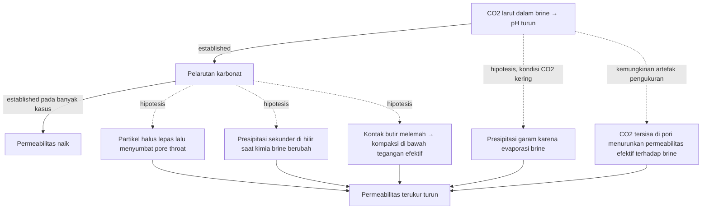

# Example: Mechanism with competing hypotheses (input classes B + E), Indonesian user

**Input:** "Jelaskan kenapa permeabilitas bisa turun setelah injeksi CO2 pada batuan karbonat."

**Why this selection:** the observation (permeability decrease) has several plausible mechanisms, some of which act in opposite directions (dissolution normally *increases* permeability). A single-chain explanation would be mechanism collapse. Causal diagram + evidence table expose the alternatives.

---

## Expected response (abridged)

```text
Intent
↓
penjelasan mekanisme dari hasil eksperimen

Topic
↓
penurunan permeabilitas setelah injeksi CO2 pada karbonat

Problem structure
↓
kausal + beberapa mekanisme bersaing + geokimia–mekanik

Best representation
↓
causal diagram dengan label status
+ tabel evidence per mekanisme
+ penjelasan terkontrol
```

**Observasi (bukan interpretasi).** Permeabilitas terukur setelah interaksi CO2–brine–batuan lebih rendah daripada sebelumnya. Kondisi eksperimen (tekanan, temperatur, komposisi brine, laju injeksi, durasi, cara mengukur k) menentukan mekanisme mana yang mungkin. Kalau kondisi ini tidak diberikan, sebutkan bahwa informasinya tidak ada.

**Konteks yang perlu dicatat.** CO2 larut dalam brine dan membentuk asam karbonat. Asam ini melarutkan kalsit/dolomit. Pelarutan saja biasanya menaikkan permeabilitas (established untuk banyak kasus, mis. wormholing). Jadi penurunan permeabilitas butuh mekanisme lain, atau kombinasi.



Legenda: garis solid = established; garis putus = hipotesis atau kemungkinan, belum diuji pada data ini.

| Mekanisme | Status | Prediksi yang akan mendukung | Uji pembeda |
|---|---|---|---|
| Migrasi fines | hipotesis | partikel di effluent; Δp naik bertahap/fluktuatif | analisis effluent, SEM pore throat |
| Presipitasi sekunder | hipotesis | mineral baru; perubahan ion di effluent | XRD/SEM sebelum–sesudah, kimia effluent |
| Kompaksi mekanik | hipotesis | porositas turun, deformasi sampel | pengukuran porositas/volume, micro-CT |
| Presipitasi garam | hipotesis (hanya jika ada aliran CO2 kering) | kristal halit dekat inlet | SEM/EDS inlet, uji ulang setelah flushing brine segar |
| Saturasi CO2 sisa | kemungkinan artefak | k pulih setelah CO2 dibuang | ukur ulang k pada 100% brine |

**Kesimpulan yang boleh ditulis.** Data penurunan permeabilitas saja tidak cukup untuk memilih satu mekanisme. Mekanisme-mekanisme di atas bisa bekerja bersamaan. Uji pada tabel menentukan mekanisme yang dominan.

---

## What the example demonstrates

- Observation separated from mechanisms; experimental conditions requested, not invented.
- Competing mechanisms kept plural; mineral precipitation is not assumed to be the only one.
- Dissolution's opposite effect (k increase) shown, so the explanation is not cleaner than the science.
- Measurement artifact (residual CO2 saturation, effective vs absolute permeability) considered.
- Each dashed arrow has a status and a discriminating test.
