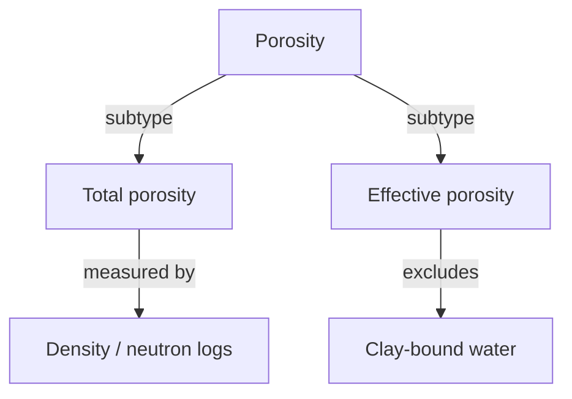
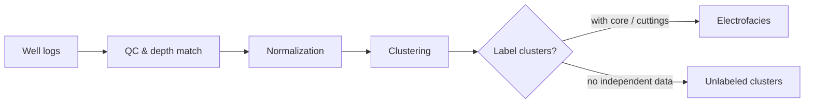

# Module: Concept Maps, Process Diagrams, Spatial Diagrams

Use when relations, sequences, or spatial arrangement matter more than causal force. If cause-effect dominates, use `causal-reasoning.md` instead.

## Concept map

Use for taxonomy, hierarchy, "how do these terms relate", comparisons (class H).

1. List 5–15 core concepts. More than 15 → split into two maps or group into clusters.
2. Every edge carries a relation label: "is a", "part of", "measured by", "computed from", "depends on", "contrasts with".
3. Do not use causal verbs on a concept map unless the causal link is established; if causality matters, switch module.
4. Comparisons: pair the map with a table whose rows are shared attributes (mechanism, conditions, typical range, limitation).

## Process diagram

Use for workflows, experiments, algorithms, processing chains (class I).

Each step specifies:

| Step | Input | Operation | Output | Assumption / choice | Failure point |
|---|---|---|---|---|---|

- Mark decision points (e.g. cutoff choice, parameter picking) — these are where results become sensitive.
- Mark where data become interpretation (e.g. "cluster → facies label").

## Spatial diagram

Use for depositional systems, pore-scale geometry, well/reservoir layouts.

- State the view (plan, cross-section, 3D sketch) and scale (schematic or to scale).
- Label positions, not only objects ("proximal", "distal", "updip").
- Put uncertain boundaries as dashed lines.

## Output

Mermaid when available; otherwise inline SVG in HTML or indented text. Short controlled text explains how to read the diagram (2–5 sentences).
