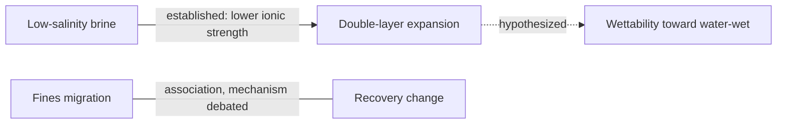

# Visualization Guidelines

Scope: scientific content of plots and diagrams. For visual styling (palette, typography, dark mode), defer to a host design/charting skill if one exists (e.g. `dataviz`, `artifact-design`).

## Plots

- Axis labels carry quantity **and** unit: "Sw (fraction)", "Pc (psi)", "Depth (m MD)".
- Use the conventional orientation of the field (e.g. depth increasing downward in log plots; Sw on x for Pc–Sw and fw–Sw).
- Data points vs model curves are visually distinct (markers vs lines) and labeled "data" / "model".
- Schematic curves (shape only) are labeled "schematic" or "illustrative" and have no misleading tick values.
- Show uncertainty when it exists: error bars, bands, or ensemble spread. If uncertainty is unknown, say "uncertainty not reported".
- One message per plot. A plot that needs a long paragraph to read is doing too much; split it or annotate it.
- Annotate the feature the explanation refers to (tangent point, breakthrough, inflection, threshold).
- Log axes when the variable spans orders of magnitude (permeability, resistivity); state it.
- No dual y-axes unless the two quantities are physically linked and the link is the point.

## Diagrams

### Arrow semantics (causal diagrams)

| Notation | Meaning | Line style |
|---|---|---|
| `A → B` | A causes/drives B through a stated mechanism | solid |
| `A ↔ B` | mutual influence / feedback | solid, two heads |
| `A ⇢ B` | proposed or inferred causal link | dashed |
| `A — B` | association only, mechanism not established | dotted, no head |

Every diagram with mixed arrow types carries a legend. Every arrow can be justified in one sentence; if it cannot, it is removed or downgraded.

### Mermaid conventions

- `-->` causal, `-.->` inferred/hypothesized, `---` association. Put the status in the edge label.
- Keep node text short; details go in the accompanying text.
- If Mermaid rendering is unavailable, deliver the Mermaid source and an indented-text version.

### Concept maps and process diagrams

- Concept-map edges are labeled with the relation ("is a", "measured by", "controls", "part of"). An unlabeled edge implies nothing; avoid it.
- Process diagram steps show input → operation → output; assumptions are attached to the step that makes them.

## Data integrity in visuals

- Never draw data that do not exist. Synthetic data are titled "synthetic".
- Do not smooth, interpolate, or extrapolate without saying so.
- Color scales for continuous data are perceptually ordered; categorical colors for categories only.
